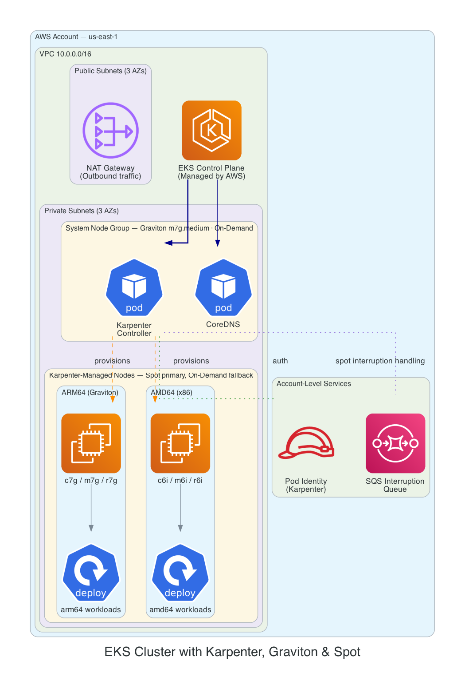
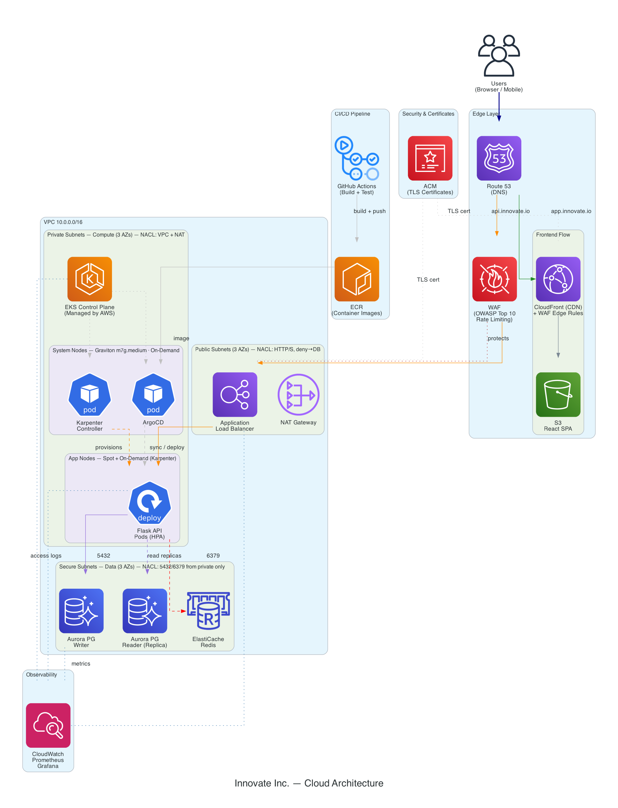

# EKS with Karpenter, Graviton & Spot + Cloud Architecture Design

Technical assessment consisting of two deliverables: a production-ready EKS cluster with Karpenter (Terraform) and a full cloud architecture design for a Flask/React application.

---

## Task 1: EKS with Karpenter, Graviton & Spot

Terraform code that deploys an EKS cluster with intelligent autoscaling via Karpenter, supporting both **x86 (AMD64)** and **ARM64 (Graviton)** architectures with **Spot** and **On-Demand** capacity types.

| Component | Details |
|-----------|---------|
| **EKS** | Kubernetes 1.35 (latest), managed control plane |
| **Karpenter** | v1.9.0, Pod Identity auth, SQS interruption handling |
| **System nodes** | Graviton `m7g.medium` (On-Demand) — ~20% savings vs x86 |
| **App nodes** | Spot primary, On-Demand fallback, c/m/r families (6th gen+) |
| **Network** | Three-tier subnets (public → private → secure) with dedicated NACLs |
| **Security** | Database tier only accepts 5432/6379 from compute subnets; public→data blocked |



**Quick start:** `cd terraform && terraform init && terraform plan`

Full documentation: [terraform/README.md](terraform/README.md)

---

## Task 2: Architecture Design — Innovate Inc.

Cloud architecture for a Python/Flask REST API + React SPA backed by PostgreSQL, designed to scale from hundreds to millions of daily users.

| Layer | Technology | Key Decision |
|-------|-----------|--------------|
| **Edge** | Route 53 + CloudFront + WAF | Separate flows: CDN for SPA, WAF+ALB for API |
| **Compute** | EKS + Karpenter | Graviton Spot nodes, HPA scaling, ArgoCD GitOps |
| **Data** | Aurora PostgreSQL + ElastiCache Redis | Serverless v2 for dev, provisioned + replicas for prod |
| **Network** | Three-tier VPC + NACLs | Defense-in-depth: SGs + NACLs + Network Policies |
| **CI/CD** | GitHub Actions + ArgoCD | Multi-arch builds, Trivy scanning, GitOps deployment |
| **Observability** | Prometheus + Grafana + Loki + Tempo | Full stack: metrics, logs, traces, alerting |



Full documentation: [architecture/README.md](architecture/README.md)

---

## Key Design Decisions

1. **Karpenter over Cluster Autoscaler** — Right-sized nodes per workload, Spot diversification across instance families, faster scaling
2. **Graviton-first strategy** — ~20% better price-performance; system nodes already on ARM64
3. **Three-tier network segmentation** — Secure database subnets with NACL enforcement, not just security groups
4. **Pod Identity over IRSA** — Modern EKS auth approach, cleaner IAM management
5. **Diagrams as code** — Architecture diagrams generated via Python scripts ([terraform/diagrams/](terraform/diagrams/), [architecture/diagrams/](architecture/diagrams/)) for reproducibility

## Repository Structure

```
.
├── terraform/                  # Task 1: Infrastructure as Code
│   ├── *.tf                    # EKS, VPC, Karpenter, NACLs
│   ├── examples/               # Demo deployments (Graviton, x86, multi-arch)
│   └── diagrams/               # Architecture diagram (as code)
├── architecture/               # Task 2: Architecture Design
│   ├── README.md               # Full architecture document
│   └── diagrams/               # Architecture diagram (as code)
```

## Author

Diego Ramos — Senior DevOps/SRE Engineer
Email: diego@cloudville.io
